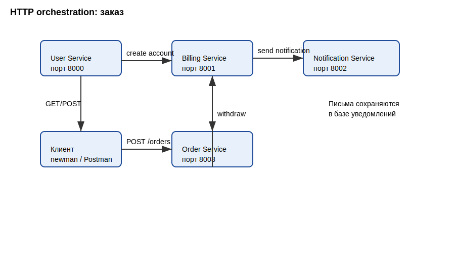
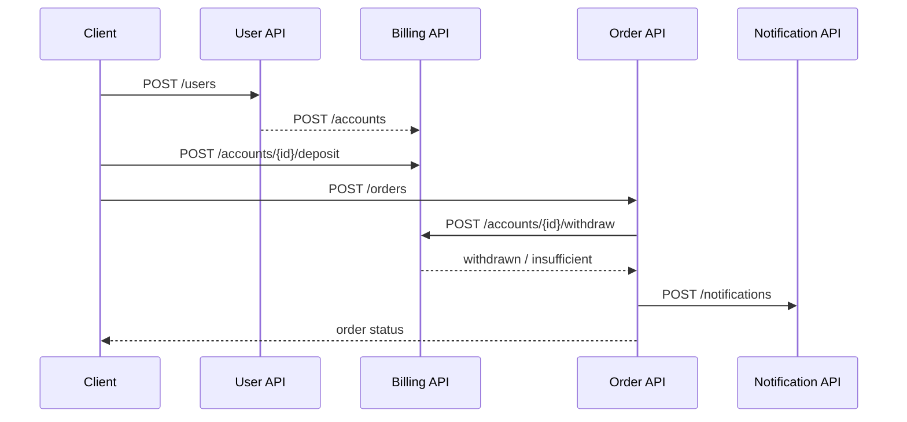
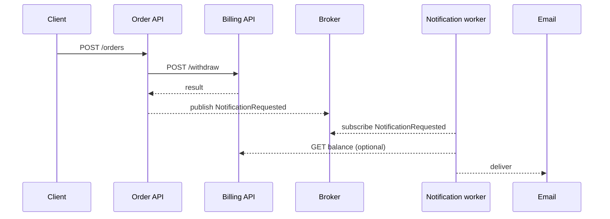
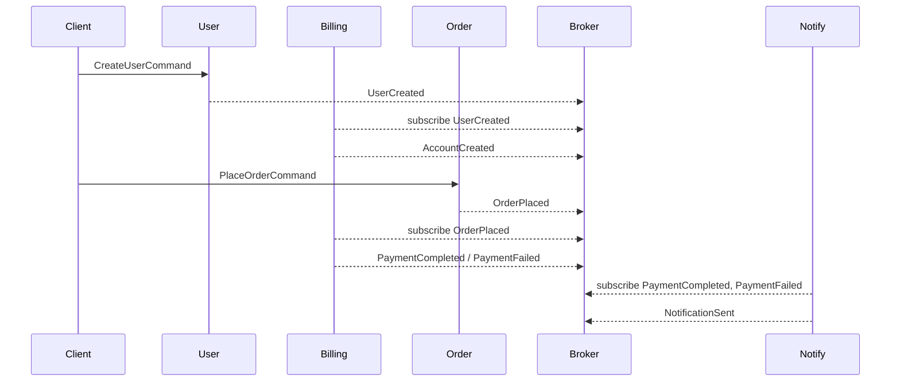

# Архитектура решения

## Выбранный вариант
Практическая часть реализована в стиле **HTTP orchestration**: сервис заказов управляет сценарием оформления заказа через REST вызовы к сервисам пользователей, биллинга и нотификаций.



## Варианты взаимодействий

### HTTP-only orchestration


**IDL (OpenAPI фрагменты)**
```yaml
paths:
  /users:
    post:
      summary: Создать пользователя и аккаунт в биллинге
      responses:
        '201': { $ref: '#/components/schemas/User' }
  /accounts/{userId}/withdraw:
    post:
      summary: Списать средства
      responses:
        '200': { $ref: '#/components/schemas/PaymentResult' }
  /notifications:
    post:
      summary: Сохранить уведомление
      responses:
        '201': { $ref: '#/components/schemas/Notification' }
```

### Событийное взаимодействие с брокером для нотификаций


**IDL (AsyncAPI фрагмент для брокера)**
```yaml
channels:
  notification.requested:
    publish:
      message:
        name: NotificationRequested
        payload:
          type: object
          properties:
            userId: { type: integer }
            email: { type: string, format: email }
            status: { enum: [confirmed, failed] }
            price: { type: number }
```

### Event Collaboration через брокер


**IDL (команды/события)**
```yaml
messages:
  UserCreated:
    payload:
      type: object
      properties:
        userId: { type: integer }
        email: { type: string }
  PaymentFailed:
    payload:
      type: object
      properties:
        orderId: { type: integer }
        reason: { type: string }
```

### Наиболее адекватный вариант
Для учебного решения выбран вариант HTTP orchestration (первый), так как он проще всего поднимается локально без брокера и демонстрирует все требуемые шаги.
